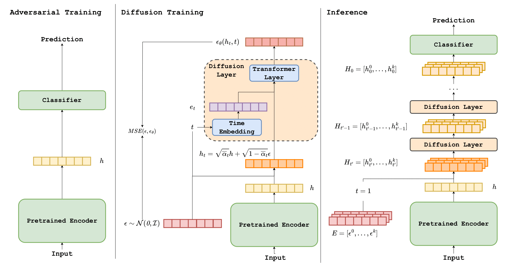

# DiffuseDef: Improved Robustness to Adversarial Attacks


## Installation
```
pip install -r requirements.txt
```

## Training
### 1. Adversarial training
The FreeLB++ model is trained with [TextDefender](https://github.com/RockyLzy/TextDefender) tool.
```
python main.py --mode train --dataset_name agnews --max_seq_len 128 --epochs 10 --batch_size 64 --training_type freelb --adv-steps 30
```
The RSMI model is trained with [RSMI](https://github.com/Han8931/rsmi_nlp) tool.
```
python main_rsmi.py --model_dir_path ./cls_task/checkpoint/1/ \
    --dataset ag --batch_size 24 --epochs 10 --save_model rsmi_bert_ag \
    --lr 1e-5 --num_classes 4 --alpha_p 0.98 \
    --model bert --nth_layers 3 --noise_eps 0.2 --max_seq_length 128 \
    --seed 1000 --exp_dir ./experiments/ag/bert/1/ \
    --multi_mask 2 --custom_forward --save
```
After the training is done, move the checkpoint under `./checkpoints`

### 2. Diffusion training
The diffusion training uses `train_diffusion.py` file and loads the pre-trained checkpoint from adversarial training. It uses a config file to train the diffusion layer.
```
python train_diffusion.py -c configs/diffuse_train_freelb_agnews.yaml
```
You will need to update the `cls_path` to the corresponding checkpoint from the output of adversarial training.

## Attack / Evaluation
The adversarial attack is performed with textattack using `attack.py`. It samples 1000 examples from the test set and perform the adversarial attack. For example
```
python attack.py -d ./experiments/agnews/diffuse_freelb/ensemble_seed1 -am textfooler -mr 0.3 -ds 5
```

The evaluation is performed on all examples in the test set WITHOUT adversarial attack, it reports the clean text accuracy. Note that the `eval_batch_size` needs to be set to 1 in the config file, otherwise the eval script might fail and report incorrect results.
```
python eval.py -c configs/diffuse_train_freelb_agnews.yaml -d ./experiments/agnews/diffuse_freelb/ensemble_seed1
```

## Citation
TBD